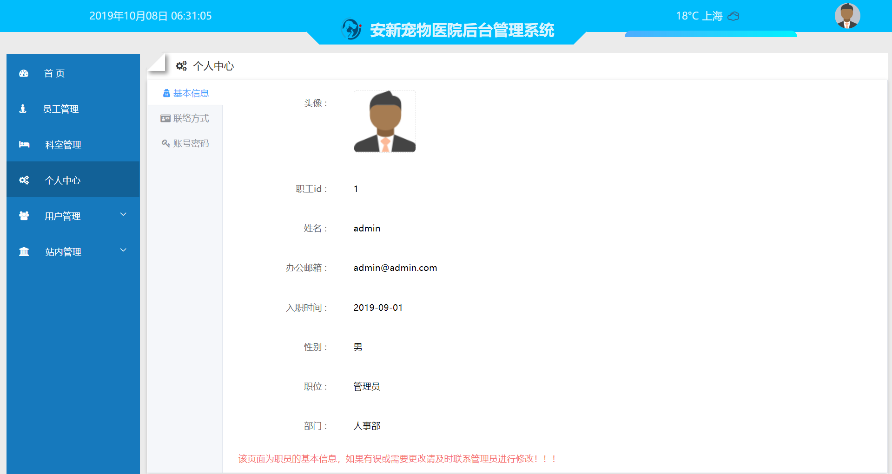

## 安新宠物医院

### Project setup

~~~
npm install 或 yarn install
~~~

### 项目说明

​    随着信息技术在各行各业之中的广泛应用和人们生活水平的日益提高,使我们的生活日益丰富多彩,宠物也成为了人们的亲密伙伴,越来越多的人们开始家庭养宠物来增加生活的乐趣。这种变化对宠物医院的管理产生了极大影响,传统的工作方式正在被信息化所取代。基于这种趋势下，建立和实现一个基于vue.js和node.js的响应式宠物医院管理网站，并使用MySql作为宠物医院管理系统的设计，以便于提高宠物医院管理工作的效率,实现了管理的信息化、科学化、规范化。 

### 技术栈

 Vue.js + Node.js+MySQL

- Vue.js部分 使用的是Vue-CLI3脚手架
- Node.js部分 使用的是EXPRESS框架
- 在该项目中 样式使用的是CSS的预处理语言 less
- 组件库   饿了么的ElementUI

### 项目目录结构

~~~
- admin_client
	--- 这是项目前台的后台管理系统，以便于医师和管理员进行日常的相关工作和权限管理使用
- admin_user
	--- 这是项目前台的用户界面，主要便于用户的相应操作，其可以适应于一些主流的PC端和移动端
- admin_server
	--- 这是项目后端的服务器端，通过EXPRESS框架搭建，主要为前端界面提供相应的Web API接口，以达到前后端分离
- sql
	--- 这是项目的数据库中sql脚本文件，主要包含了本项目中使用到的一些表结构和一些测试数据
- media 
	--- 这是README.md 文件中所使用到的图片的资源文件(可忽略)
~~~

### 系统结构图

#### 前台部分

 

系统前台功能结构图

#### 后台部分

##### 管理员模块

 

系统后台功能结构图---管理员模块

##### 医师模块

 

系统后台功能结构图---医师模块

### 配置跨域/vue.config.js

   在项目的编写中，因为后端服务器的url地址和前端的url地址不同源，所以出现了`Access-Control-Allow-Origin`，也就是无法进行跨域操作，经过查阅资料，在项目中建立了`vue.config.js`文件，使用代理的方式来解决跨域问题

~~~js
devServer: {
    proxy: {  //进行跨域配置
      "/api": {
        target: 'http://localhost:3000/api/',
        ws: true,
        changOrigin: true,
        pathRewrite: {
          '^/api': ''
        }
      }
    }
~~~

### axios 请求拦截和响应拦截

​		在本项目中，为了在数据加载的过程中，出现遮罩层，在数据加载完毕后，遮罩层自动取消，经过查阅资料，在本项目中决定使用axios的 请求拦截和响应拦截

~~~js
// 设置axios的请求和响应拦截

import axios from 'axios'
import { Message, Loading } from 'element-ui';
import router from './router'

let loading

const startLoading = () => {    
    loading = Loading.service({
        lock: true,
        text: '拼命加载中。。。',
        background: 'rgba(0, 0, 0, 0.7)'
    })
}

const endLoading = () => {    
    loading.close()
}

// 请求拦截  设置统一header
axios.interceptors.request.use(config => {
    startLoading()

    return config
}, error => {
    return Promise.reject(error)
})

// 响应拦截  
axios.interceptors.response.use(response => {
    endLoading()

    return response
}, error => {
    // 错误提醒
    endLoading()

    Message.error(error.response.data)

    router.push('/login')

    return Promise.reject(error)
})

export default axios
~~~

### 部分页面展示

#### 前台部分

 

前台 主页(PC端)

 

前台 主页(移动端)

 

预约服务模块 (PC端)

 

新闻资讯(PC端)

 

科室信息展示 (移动端)

#### 后台部分

 

管理员后台管理主界面

 

医师 后台管理主界面

 

个人中心页面

 

成功案例页面

 

成功案例的修改模块
